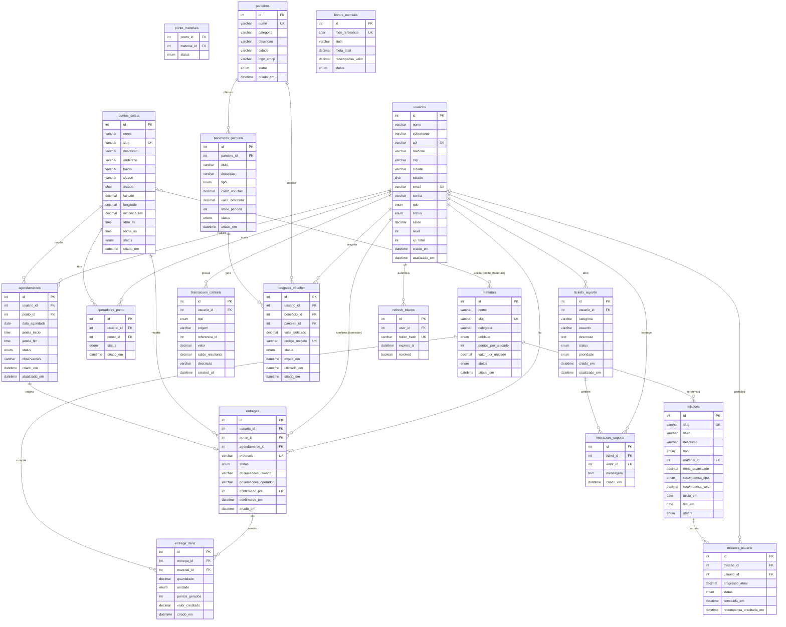

# EcoDrop — Documentação do Banco de Dados

**SGBD:** MySQL 8.0+  
**ORM:** SQLAlchemy 2.0 com Alembic  
**Database:** `ecodrop_db`  
**Última migration:** `2d250a5cdd67` — 2026-05-15

---

## Diagrama Entidade-Relacionamento (MER)

---

## Tabelas

### `usuarios`
Entidade central do sistema. Representa clientes, operadores e administradores.

| Coluna | Tipo | Restrições |
|--------|------|-----------|
| id | INT | PK, AUTO_INCREMENT |
| nome | VARCHAR(100) | NOT NULL |
| sobrenome | VARCHAR(100) | NOT NULL |
| cpf | VARCHAR(20) | NOT NULL, UNIQUE |
| telefone | VARCHAR(20) | NOT NULL |
| cep | VARCHAR(10) | NOT NULL |
| cidade | VARCHAR(100) | NOT NULL |
| estado | CHAR(2) | NOT NULL |
| email | VARCHAR(150) | NOT NULL, UNIQUE |
| senha | VARCHAR(255) | NOT NULL |
| role | ENUM('user', 'operator', 'admin') | NOT NULL, DEFAULT='user' |
| status | ENUM('active', 'inactive', 'blocked') | NOT NULL, DEFAULT='active' |
| saldo | DECIMAL(10,2) | NOT NULL, DEFAULT=0.00 |
| nivel | INT | NOT NULL, DEFAULT=1 |
| xp_total | INT | NOT NULL, DEFAULT=0 |
| criado_em | DATETIME | NOT NULL |
| atualizado_em | DATETIME | NOT NULL |

---

### `materiais`
Tipos de materiais recicláveis aceitos pelo sistema.

| Coluna | Tipo | Restrições |
|--------|------|-----------|
| id | INT | PK, AUTO_INCREMENT |
| nome | VARCHAR(100) | NOT NULL |
| slug | VARCHAR(100) | NOT NULL, UNIQUE |
| categoria | VARCHAR(50) | NOT NULL |
| unidade | ENUM('kg', 'un') | NOT NULL, DEFAULT='kg' |
| pontos_por_unidade | INT | NOT NULL |
| valor_por_unidade | DECIMAL(10,2) | NOT NULL |
| status | ENUM('active', 'inactive') | NOT NULL, DEFAULT='active' |
| criado_em | DATETIME | NOT NULL |

---

### `pontos_coleta`
Pontos físicos onde os usuários entregam materiais recicláveis.

| Coluna | Tipo | Restrições |
|--------|------|-----------|
| id | INT | PK, AUTO_INCREMENT |
| nome | VARCHAR(150) | NOT NULL |
| slug | VARCHAR(150) | NOT NULL, UNIQUE |
| descricao | VARCHAR(255) | NULLABLE |
| endereco | VARCHAR(255) | NOT NULL |
| bairro | VARCHAR(120) | NULLABLE |
| cidade | VARCHAR(100) | NOT NULL |
| estado | CHAR(2) | NOT NULL |
| latitude | DECIMAL(10,7) | NULLABLE |
| longitude | DECIMAL(10,7) | NULLABLE |
| distancia_km | DECIMAL(5,2) | NULLABLE |
| abre_as | TIME | NULLABLE |
| fecha_as | TIME | NULLABLE |
| status | ENUM('active', 'inactive') | NOT NULL, DEFAULT='active' |
| criado_em | DATETIME | NOT NULL |

---

### `ponto_materiais`
Tabela de junção N:N entre pontos de coleta e materiais aceitos.

| Coluna | Tipo | Restrições |
|--------|------|-----------|
| ponto_id | INT | PK (composto), FK → pontos_coleta.id |
| material_id | INT | PK (composto), FK → materiais.id |
| status | ENUM('active', 'inactive') | NOT NULL, DEFAULT='active' |

---

### `operadores_ponto`
Vincula usuários com role `operator` aos pontos de coleta que gerenciam.

| Coluna | Tipo | Restrições |
|--------|------|-----------|
| id | INT | PK, AUTO_INCREMENT |
| usuario_id | INT | NOT NULL, FK → usuarios.id |
| ponto_id | INT | NOT NULL, FK → pontos_coleta.id |
| status | ENUM('active', 'inactive') | NOT NULL, DEFAULT='active' |
| criado_em | DATETIME | NOT NULL |

**Unique:** (usuario_id, ponto_id)

---

### `agendamentos`
Agendamentos de entrega feitos por usuários em pontos de coleta.

| Coluna | Tipo | Restrições |
|--------|------|-----------|
| id | INT | PK, AUTO_INCREMENT |
| usuario_id | INT | NOT NULL, FK → usuarios.id |
| ponto_id | INT | NOT NULL, FK → pontos_coleta.id |
| data_agendada | DATE | NOT NULL |
| janela_inicio | TIME | NOT NULL |
| janela_fim | TIME | NOT NULL |
| status | ENUM('scheduled', 'confirmed', 'checked_in', 'completed', 'cancelled', 'missed') | NOT NULL, DEFAULT='scheduled' |
| observacoes | VARCHAR(255) | NULLABLE |
| criado_em | DATETIME | NOT NULL |
| atualizado_em | DATETIME | NOT NULL |

---

### `entregas`
Registro de cada entrega de material reciclável realizada.

| Coluna | Tipo | Restrições |
|--------|------|-----------|
| id | INT | PK, AUTO_INCREMENT |
| usuario_id | INT | NOT NULL, FK → usuarios.id |
| ponto_id | INT | NOT NULL, FK → pontos_coleta.id |
| agendamento_id | INT | NULLABLE, FK → agendamentos.id |
| protocolo | VARCHAR(50) | NOT NULL, UNIQUE |
| status | ENUM('pending_confirmation', 'confirmed', 'rejected', 'cancelled') | NOT NULL, DEFAULT='pending_confirmation' |
| observacoes_usuario | VARCHAR(255) | NULLABLE |
| observacoes_operador | VARCHAR(255) | NULLABLE |
| confirmado_por | INT | NULLABLE, FK → usuarios.id |
| confirmado_em | DATETIME | NULLABLE |
| criado_em | DATETIME | NOT NULL |

---

### `entrega_itens`
Itens individuais de cada entrega (quais materiais e quantidades).

| Coluna | Tipo | Restrições |
|--------|------|-----------|
| id | INT | PK, AUTO_INCREMENT |
| entrega_id | INT | NOT NULL, FK → entregas.id |
| material_id | INT | NOT NULL, FK → materiais.id |
| quantidade | DECIMAL(10,2) | NOT NULL |
| unidade | ENUM('kg', 'un') | NOT NULL |
| pontos_gerados | INT | NOT NULL |
| valor_creditado | DECIMAL(10,2) | NOT NULL |
| criado_em | DATETIME | NOT NULL |

---

### `transacoes_carteira`
Histórico de todas as movimentações financeiras da carteira do usuário.

| Coluna | Tipo | Restrições |
|--------|------|-----------|
| id | INT | PK, AUTO_INCREMENT |
| usuario_id | INT | NOT NULL, FK → usuarios.id |
| tipo | ENUM('credit', 'debit', 'bonus', 'reversal', 'adjustment') | NOT NULL |
| origem | VARCHAR(50) | NOT NULL |
| referencia_id | INT | NULLABLE |
| valor | DECIMAL(10,2) | NOT NULL |
| saldo_resultante | DECIMAL(10,2) | NOT NULL |
| descricao | VARCHAR(255) | NOT NULL |
| created_at | DATETIME | NOT NULL |

---

### `parceiros`
Empresas parceiras que oferecem benefícios/vouchers aos usuários.

| Coluna | Tipo | Restrições |
|--------|------|-----------|
| id | INT | PK, AUTO_INCREMENT |
| nome | VARCHAR(150) | NOT NULL, UNIQUE |
| categoria | VARCHAR(80) | NOT NULL |
| descricao | VARCHAR(255) | NOT NULL |
| cidade | VARCHAR(100) | NOT NULL |
| logo_emoji | VARCHAR(10) | NOT NULL |
| status | ENUM('active', 'inactive') | NOT NULL, DEFAULT='active' |
| criado_em | DATETIME | NOT NULL |

---

### `beneficios_parceiro`
Benefícios (descontos, créditos, cashback) oferecidos por cada parceiro.

| Coluna | Tipo | Restrições |
|--------|------|-----------|
| id | INT | PK, AUTO_INCREMENT |
| parceiro_id | INT | NOT NULL, FK → parceiros.id |
| titulo | VARCHAR(150) | NOT NULL |
| descricao | VARCHAR(255) | NOT NULL |
| tipo | ENUM('discount', 'credit', 'cashback', 'bill_payment') | NOT NULL, DEFAULT='discount' |
| custo_voucher | DECIMAL(10,2) | NOT NULL |
| valor_desconto | DECIMAL(10,2) | NULLABLE |
| limite_periodo | INT | NULLABLE |
| status | ENUM('active', 'inactive') | NOT NULL, DEFAULT='active' |
| criado_em | DATETIME | NOT NULL |

**Unique:** (parceiro_id, titulo)

---

### `resgates_voucher`
Registro de vouchers resgatados por usuários junto a parceiros.

| Coluna | Tipo | Restrições |
|--------|------|-----------|
| id | INT | PK, AUTO_INCREMENT |
| usuario_id | INT | NOT NULL, FK → usuarios.id |
| beneficio_id | INT | NOT NULL, FK → beneficios_parceiro.id |
| parceiro_id | INT | NOT NULL, FK → parceiros.id |
| valor_debitado | DECIMAL(10,2) | NOT NULL |
| codigo_resgate | VARCHAR(50) | NOT NULL, UNIQUE |
| status | ENUM('generated', 'used', 'expired', 'cancelled') | NOT NULL, DEFAULT='generated' |
| expira_em | DATETIME | NULLABLE |
| utilizado_em | DATETIME | NULLABLE |
| criado_em | DATETIME | NOT NULL |

---

### `missoes`
Missões/desafios criados para incentivar reciclagem pelos usuários.

| Coluna | Tipo | Restrições |
|--------|------|-----------|
| id | INT | PK, AUTO_INCREMENT |
| slug | VARCHAR(100) | NOT NULL, UNIQUE |
| titulo | VARCHAR(150) | NOT NULL |
| descricao | VARCHAR(255) | NOT NULL |
| tipo | ENUM('material_weight', 'material_count', 'monthly_goal') | NOT NULL |
| material_id | INT | NULLABLE, FK → materiais.id |
| meta_quantidade | DECIMAL(10,2) | NOT NULL |
| recompensa_tipo | ENUM('voucher', 'xp') | NOT NULL, DEFAULT='voucher' |
| recompensa_valor | DECIMAL(10,2) | NOT NULL |
| inicio_em | DATE | NOT NULL |
| fim_em | DATE | NOT NULL |
| status | ENUM('active', 'inactive') | NOT NULL, DEFAULT='active' |

---

### `missoes_usuario`
Progresso individual de cada usuário nas missões disponíveis.

| Coluna | Tipo | Restrições |
|--------|------|-----------|
| id | INT | PK, AUTO_INCREMENT |
| missao_id | INT | NOT NULL, FK → missoes.id |
| usuario_id | INT | NOT NULL, FK → usuarios.id |
| progresso_atual | DECIMAL(10,2) | NOT NULL, DEFAULT=0 |
| status | ENUM('active', 'completed', 'expired') | NOT NULL, DEFAULT='active' |
| concluida_em | DATETIME | NULLABLE |
| recompensa_creditada_em | DATETIME | NULLABLE |

**Unique:** (missao_id, usuario_id)

---

### `bonus_mensais`
Metas mensais coletivas com recompensas para usuários participantes.

| Coluna | Tipo | Restrições |
|--------|------|-----------|
| id | INT | PK, AUTO_INCREMENT |
| mes_referencia | CHAR(7) | NOT NULL, UNIQUE (formato: YYYY-MM) |
| titulo | VARCHAR(150) | NOT NULL |
| meta_total | DECIMAL(10,2) | NOT NULL |
| recompensa_valor | DECIMAL(10,2) | NOT NULL |
| status | ENUM('active', 'inactive') | NOT NULL, DEFAULT='active' |

---

### `tickets_suporte`
Tickets de suporte abertos pelos usuários.

| Coluna | Tipo | Restrições |
|--------|------|-----------|
| id | INT | PK, AUTO_INCREMENT |
| usuario_id | INT | NOT NULL, FK → usuarios.id |
| categoria | VARCHAR(80) | NOT NULL |
| assunto | VARCHAR(150) | NOT NULL |
| descricao | TEXT | NOT NULL |
| status | ENUM('open', 'in_progress', 'resolved', 'closed') | NOT NULL, DEFAULT='open' |
| prioridade | ENUM('low', 'medium', 'high') | NOT NULL, DEFAULT='medium' |
| criado_em | DATETIME | NOT NULL |
| atualizado_em | DATETIME | NOT NULL |

---

### `interacoes_suporte`
Mensagens trocadas dentro de um ticket de suporte.

| Coluna | Tipo | Restrições |
|--------|------|-----------|
| id | INT | PK, AUTO_INCREMENT |
| ticket_id | INT | NOT NULL, FK → tickets_suporte.id |
| autor_id | INT | NOT NULL, FK → usuarios.id |
| mensagem | TEXT | NOT NULL |
| criado_em | DATETIME | NOT NULL |

---

### `refresh_tokens`
Tokens de autenticação JWT para renovação de sessão.

| Coluna | Tipo | Restrições |
|--------|------|-----------|
| id | INT | PK, AUTO_INCREMENT |
| user_id | INT | NOT NULL, FK → usuarios.id |
| token_hash | VARCHAR(255) | NOT NULL, UNIQUE |
| expires_at | DATETIME (timezone-aware) | NOT NULL |
| revoked | BOOLEAN | NOT NULL, DEFAULT=FALSE |

---

## Mapa de Relacionamentos

| Tabela A | Cardinalidade | Tabela B | Via / Coluna FK |
|----------|:---:|----------|-----------------|
| usuarios | 1:N | transacoes_carteira | transacoes_carteira.usuario_id |
| usuarios | 1:N | agendamentos | agendamentos.usuario_id |
| usuarios | 1:N | entregas | entregas.usuario_id |
| usuarios | 1:N | entregas | entregas.confirmado_por (operador) |
| usuarios | 1:N | operadores_ponto | operadores_ponto.usuario_id |
| usuarios | 1:N | missoes_usuario | missoes_usuario.usuario_id |
| usuarios | 1:N | resgates_voucher | resgates_voucher.usuario_id |
| usuarios | 1:N | tickets_suporte | tickets_suporte.usuario_id |
| usuarios | 1:N | interacoes_suporte | interacoes_suporte.autor_id |
| usuarios | 1:N | refresh_tokens | refresh_tokens.user_id |
| pontos_coleta | N:N | materiais | ponto_materiais |
| pontos_coleta | 1:N | agendamentos | agendamentos.ponto_id |
| pontos_coleta | 1:N | entregas | entregas.ponto_id |
| pontos_coleta | 1:N | operadores_ponto | operadores_ponto.ponto_id |
| agendamentos | 1:0..1 | entregas | entregas.agendamento_id |
| entregas | 1:N | entrega_itens | entrega_itens.entrega_id |
| materiais | 1:N | entrega_itens | entrega_itens.material_id |
| materiais | 1:N | missoes | missoes.material_id |
| parceiros | 1:N | beneficios_parceiro | beneficios_parceiro.parceiro_id |
| parceiros | 1:N | resgates_voucher | resgates_voucher.parceiro_id |
| beneficios_parceiro | 1:N | resgates_voucher | resgates_voucher.beneficio_id |
| missoes | 1:N | missoes_usuario | missoes_usuario.missao_id |
| tickets_suporte | 1:N | interacoes_suporte | interacoes_suporte.ticket_id |

---

## Resumo

| # | Tabela | Propósito |
|---|--------|-----------|
| 1 | usuarios | Usuários, operadores e admins |
| 2 | materiais | Catálogo de materiais recicláveis |
| 3 | pontos_coleta | Pontos físicos de coleta |
| 4 | ponto_materiais | Relação N:N ponto ↔ material |
| 5 | operadores_ponto | Operadores vinculados a pontos |
| 6 | agendamentos | Agendamentos de entrega |
| 7 | entregas | Registro de entregas realizadas |
| 8 | entrega_itens | Itens detalhados de cada entrega |
| 9 | transacoes_carteira | Histórico da carteira financeira |
| 10 | parceiros | Empresas parceiras |
| 11 | beneficios_parceiro | Benefícios/vouchers dos parceiros |
| 12 | resgates_voucher | Vouchers resgatados pelos usuários |
| 13 | missoes | Missões de reciclagem |
| 14 | missoes_usuario | Progresso do usuário nas missões |
| 15 | bonus_mensais | Metas mensais coletivas |
| 16 | tickets_suporte | Tickets de suporte |
| 17 | interacoes_suporte | Mensagens dentro dos tickets |
| 18 | refresh_tokens | Tokens JWT de autenticação |
